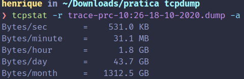

#### Descrićão da coleta dos dados

- Aplicativos
  - Chamada de audio (Discord)
  - Consumindo videos no youtube
  - Consumindo streaming de video na twitch
  - Navegando em site usando o google chrome
- Portas
- Tipo do fluxo
- Requisitos de QoS
- Caga de Tráfego

#### Dados Coletados

```{r}
data <- read.csv("vazao.csv")
```

#### Graficos de Bits/s
```{r}
plot(x = data$time, y = data$bits, xlab = "Segundos", ylab = "Bits")
```


#### Graficos de Pacotes/s
```{r}

```

#### Assumindo outros 100 usuários de comportamentos idênticos ao do tráfego

Segundo o tcpstat, em uma hora com o uso coletado, consome 1.8 GB, como pode ver na figura abaixo.



Levando em consideração horário de trabalho (8 horas por dia, 5 dias por semana) em um mês, consumiria em torno de 288 GB.
```{r}
bitsPerMonth = 1.8 * 8 * 5 * 4
bitsPerMonth
```

Assumindo 100 usuários com este mesmo uso de banda, em um mês consumiria em torno de 28.125 TB.
```{r}
bitsPerMonth * 100 / 1024
```

```{r}

```

#### Relação Bits/s e pacotes/s
```{r}

```

hist(data) -> plot um histograma
